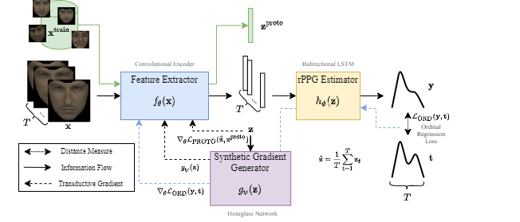

[](https://github.com/eugenelet/NeuralScale-Private/blob/master/LICENSE)


# Meta-rPPG: Remote Heart Rate Estimation Using a Transductive Meta-Learner

This repository is the official implementation of *Meta-rPPG: Remote Heart Rate Estimation Using a Transductive Meta-Learner*. 



## Requirements

To install requirements:

```setup
pip install -r requirements.txt
```

All experiments can be run on a single NVIDIA GTX1080Ti GPU.


The code was tested with python3.6 the following software versions:

| Software        | version | 
| ------------- |-------------| 
| cuDNN         | 7.6.5 |
| Pytorch      | 1.5.0  |
| CUDA | 10.2    |


## Training

### Training Data Preparation

Download training data ([example.pth](https://drive.google.com/file/d/1Z4GWiYjoQSXMYBhxBRZK9gUa1mYP0JsN/view?usp=sharing)) from Google Drive. Due to privacy issue (face images), provided data contains only a subset of the entire training data, i.e. contains faces of the authors of this paper.

Move `example.pth` to `data/` directory:
```
mv example.pth data/
```

### Begin Training

To begin training, run:

```
python3 train.py
```


## Contributing

If you find this work useful, consider citing our work using the following bibTex:
```
[to be added]
```
